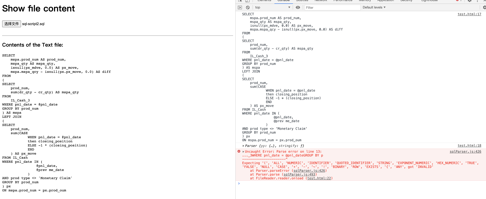

# sql-visualization
Parse, transform sql scripts, present them in web.

[TOC]

#### ToDo

- [x] Use antlr to parse sql scripts

- [ ] Use Js-sql-parser to parse sql scripts

  * Failed to parse `@` in sql script.

    

- [ ] Process the parsed results

- [ ] Present the results in web

